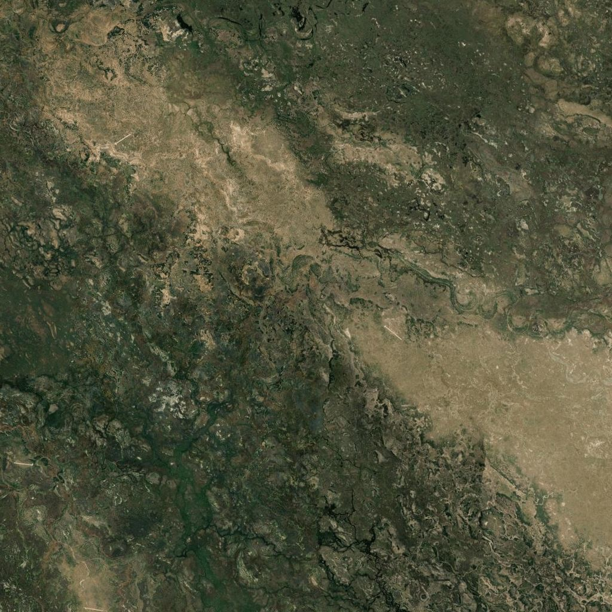
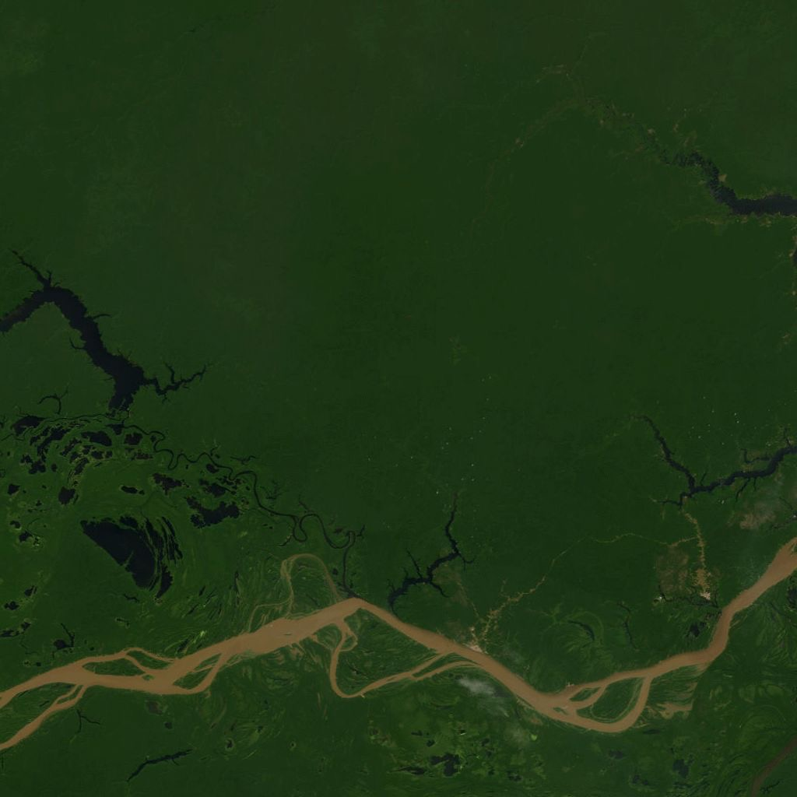
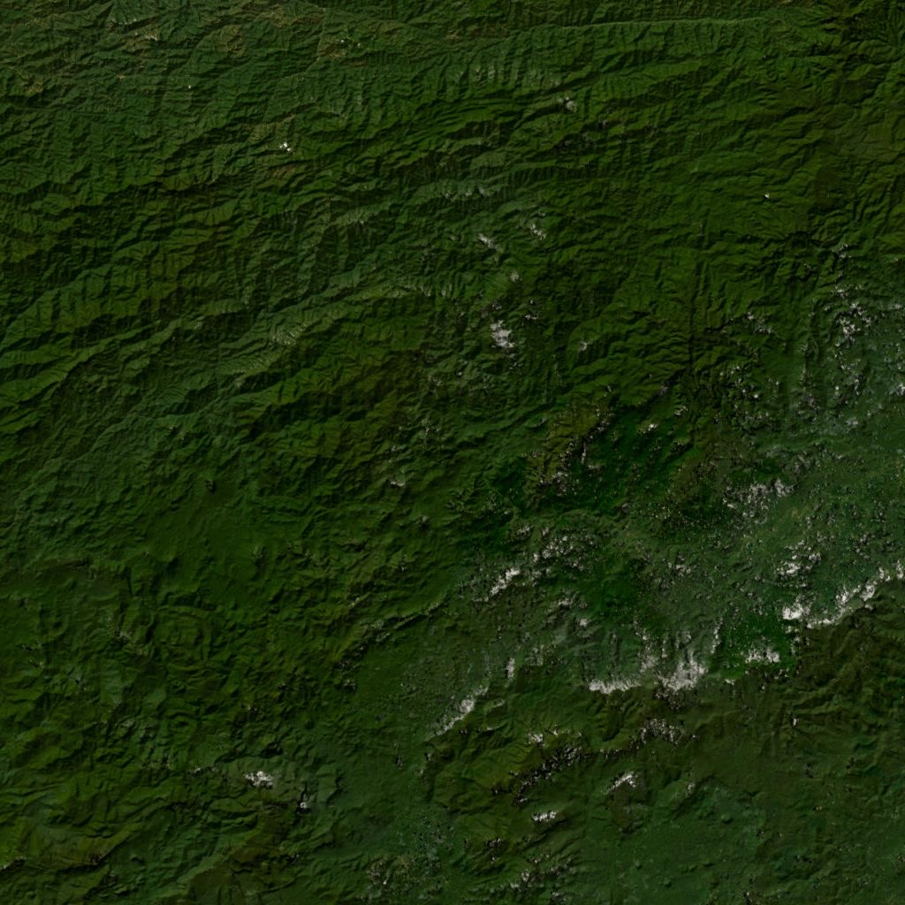
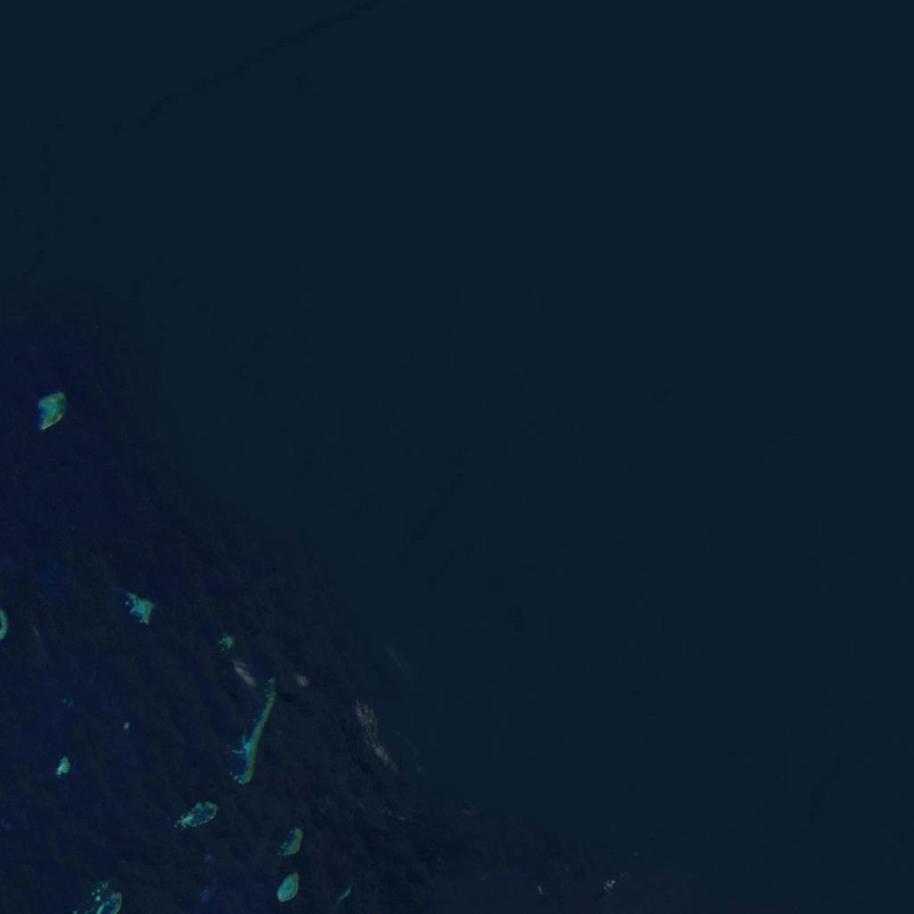
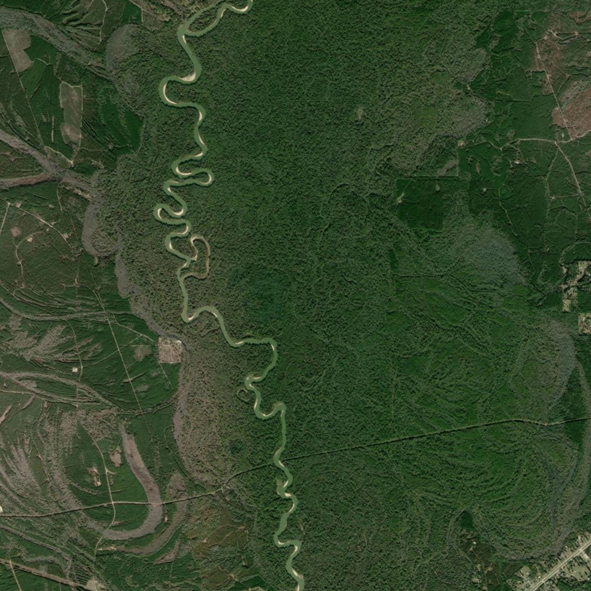
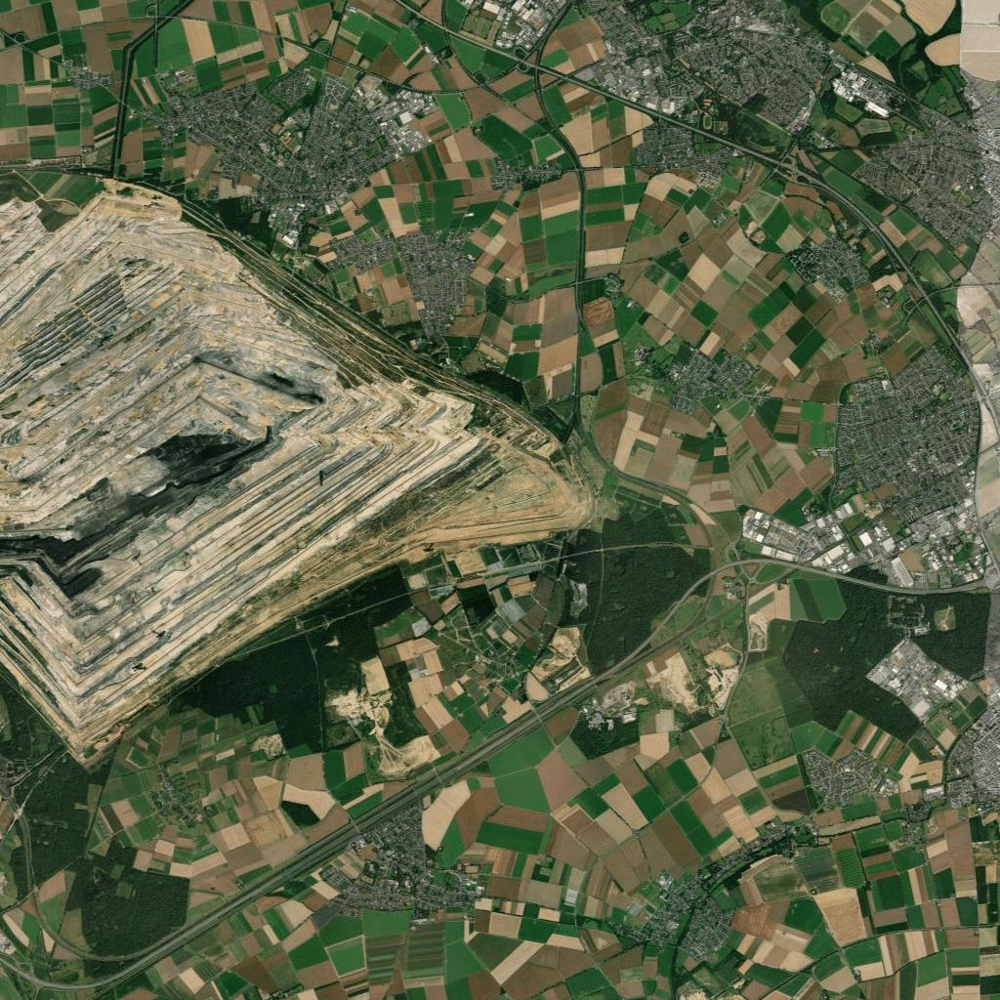
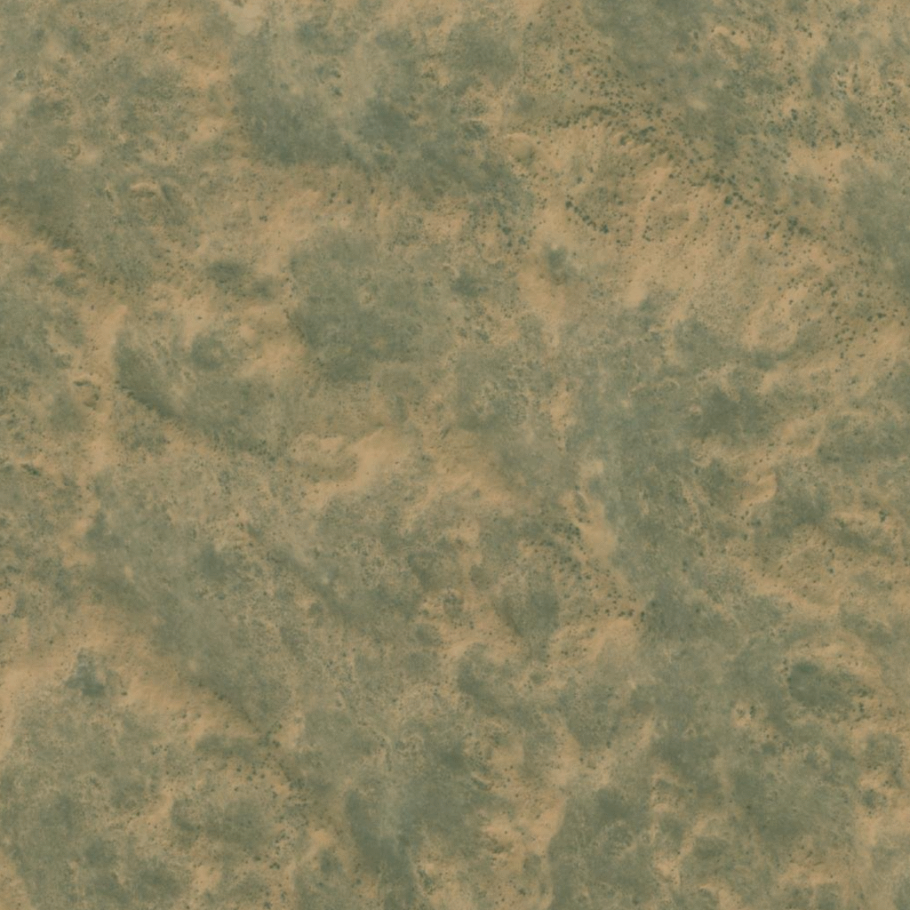

# Group_K
Code for the group assignment in Advanced Programming 2026

## Team Members
| Name | Student Number | Email |
|------|---------------|-------|
| Justus Jonas Nau | 70106 | 70106@novasbe.pt |
| Konstantin Titze | 74539 | 74539@novasbe.pt |
| Lenn Louis Schneidewind | 67548 | 67548@novasbe.pt |
| Nick Christopher Hammerschmid | 70159 | 70159@novasbe.pt |

---

## Project: Okavango Environmental Dashboard

A Streamlit-based data analysis tool for environmental protection using the **most recent data available** from Our World in Data.

### Features
- ✅ Automatically downloads and processes environmental datasets
- ✅ Visualizes global forest and land protection metrics on interactive maps
- ✅ Displays top 5 and bottom 5 countries for each metric
- ✅ Uses the most recent available data for all indicators
- ✅ Idempotent downloads (won't re-download existing files)
- ✅ PEP8 compliant, type-hinted, and Pydantic-validated code

### Installation

```bash
# Clone the repository
git clone git@github.com:nason31/Group_K.git
cd Group_K

# Install dependencies
pip install pandas geopandas streamlit matplotlib requests pydantic shapely pyyaml ollama pytest

# Install Ollama (required for AI workflow)
# macOS/Linux: https://ollama.com/download
# The app will automatically pull required models on first run

# Run tests to verify installation
pytest

# Launch the app
python main.py
```

### Quick Start

**Option 1: Using main.py (Recommended)**
```bash
python main.py
```

**Option 2: Using Streamlit directly**
```bash
streamlit run app/streamlit_app.py
```

The dashboard will open in your default web browser at `http://localhost:8501`

### Project Structure
```
Group_K/
├── downloads/              # Downloaded datasets (auto-generated)
├── app/                    # Application code
│   ├── __init__.py
│   ├── ai_backend.py       # AI pipeline: image fetch, vision model, risk assessment
│   ├── data_handler.py     # Data models and processing logic
│   ├── db.py               # Database cache logic (images.csv)
│   └── streamlit_app.py    # Streamlit dashboard UI
├── database/               # Pipeline run history
│   └── images.csv          # Cached pipeline results
├── images/                 # Downloaded satellite images (auto-generated)
├── tests/                  # Test files
│   └── okavango_test.py
├── models.yaml             # AI model configuration
├── main.py                 # Entry point
├── README.md
├── LICENSE
├── .gitignore
└── pytest.ini
```

### Datasets Used
1. **Annual Change in Forest Area** - Forest area changes over time
2. **Annual Deforestation** - Deforestation rates by country
3. **Share of Protected Land (Terrestrial)** - Protected area coverage
4. **Share of Degraded Land** - Land degradation indicators
5. **Forest Area as Share of Land** - Forest coverage percentage
6. **Natural Earth Countries Map (110m)** - World country boundaries

All data sources: [Our World in Data](https://ourworldindata.org) & [Natural Earth Data](https://www.naturalearthdata.com)

### Development

**Running Tests**
```bash
# Run all tests
pytest

# Run with verbose output
pytest -v

# Run specific test
pytest tests/okavango_test.py::test_download
```

**Code Quality**
- All code follows PEP8 naming conventions
- Type hints used throughout
- Pydantic models for data validation
- Comprehensive docstrings in NumPy style

### How It Works

### Page 1: Data Dashboard

1. **Data Download** (`download_project_data`)
   - Downloads CSV and shapefile data from OWID and Natural Earth
   - Implements idempotent downloads (skips if files exist)

2. **Data Cleaning** (`_load_and_clean_dataframes`)
   - Normalizes country code columns to "Code"
   - Filters to most recent year per country
   - Removes unnecessary columns

3. **Geospatial Merge** (`merge_geospatial_layers`)
   - Joins metrics to world map geometry
   - Uses left join to preserve all countries

4. **Visualization** (Streamlit App)
   - Interactive metric selection
   - Choropleth world map
   - Top 5 vs Bottom 5 bar chart

### Page 2: AI Workflow

1. **Coordinate Selection** — User selects latitude, longitude, and zoom level (or picks a preset region)
2. **Satellite Image Fetch** — Downloads a tile from ESRI World Imagery
3. **Image Description** — A vision model (via Ollama) describes the land cover and visible conditions
4. **Risk Assessment** — A text model evaluates the description for signs of environmental danger
5. **Result Display** — The image, description, and a visual risk badge (🟢 SAFE / 🔴 DANGER) are shown
6. **Caching** — Results are stored in `database/images.csv`; repeated queries load from cache instantly

### AI Model Configuration (`models.yaml`)

The models and prompts used by the AI workflow are fully configurable in `models.yaml` without touching any code:

```yaml
image_model:
  name: "llava:7b"
  prompt: "Describe this satellite image focusing on land use and environmental conditions."
  max_tokens: 512

text_model:
  name: "qwen3.5:4b"
  prompt: "Assess environmental risk based on the following description. Conclude with DANGER or SAFE."
  max_tokens: 512
```

---

## Example: Environmental Danger Detection

The following examples showcase the AI workflow applied to four ecologically significant regions. In each case, the pipeline fetched a satellite image for the given coordinates, passed it to a vision model for description, and then evaluated the description through a risk assessment model. The final verdict is shown as a visual badge alongside a summary of the model's reasoning.

---

### Example 1: Okavango Delta


**Verdict: ✅ Low Environmental Risk (SAFE)**

The Okavango Delta in Botswana is one of the world's largest inland river deltas and a UNESCO World Heritage Site. The satellite image shows a mosaic of wetland vegetation, open water channels, and seasonal floodplains. The vision model identified dense green areas indicative of healthy vegetation alongside patches of brown, which are consistent with natural seasonal drying rather than human-induced stress. Numerous water bodies were detected across the landscape, confirming the region's characteristic hydrology.

The risk assessment model evaluated three diagnostic criteria: evidence of widespread vegetation stress, signs of large-scale industrial pollution, and degree of urban encroachment. While limited vegetation stress was noted — consistent with drought or overgrazing in peripheral areas — no industrial activity or significant urban presence was detected. The model concluded that the observed conditions fall within the expected natural variation for this ecosystem type and issued a **SAFE** verdict.

---

### Example 2: Amazon Basin


**Verdict: ✅ Low Environmental Risk (SAFE)**

The Amazon Basin represents the world's largest tropical rainforest and one of the most biodiverse regions on Earth. The satellite image captured a broad view of the forest canopy, revealing a dominant layer of dark green vegetation characteristic of primary rainforest, interspersed with lighter green patches that may indicate secondary growth or transitional forest zones. Several river systems and still water bodies were visible, reflecting the Amazon's extensive hydrological network.

The vision model noted scattered signs of deforestation — patches where the forest canopy had been reduced, exposing lighter terrain — as well as limited urban presence described as small relative to the overall forested area. Despite these observations, the risk assessment model determined that no active large-scale industrial pollution was present, no extensive bare-earth clearing was visible, and urban density remained low. The overall condition of the ecosystem was deemed within tolerable bounds for this scale of analysis, resulting in a **SAFE** verdict. This example highlights the tool's ability to detect early-stage deforestation signals even within a broadly healthy ecosystem.

---

### Example 3: Borneo Rainforest


**Verdict: ✅ Low Environmental Risk (SAFE)**

The Borneo Rainforest is one of the oldest rainforests in the world and home to critically endangered species including orangutans and pygmy elephants. The satellite image in this example shows a mountainous landscape almost entirely covered in dense, dark green vegetation. The canopy appears continuous and well-preserved, with terrain contours clearly visible beneath the forest cover. No roads, clearings, or built structures were detected.

The vision model described the scene as a pristine, natural landscape with high biodiversity potential, noting that the absence of visible water bodies in this particular tile is explained by the elevated, mountainous terrain. The risk model confirmed the absence of all three primary risk indicators — no deforestation, no urban development, and no signs of ecosystem degradation — and issued a **SAFE** verdict. This example serves as a useful baseline reference for what a healthy, undisturbed rainforest looks like in the model's output.

---

### Example 4: Great Barrier Reef


**Verdict: ✅ Low Environmental Risk (SAFE)**

The Great Barrier Reef is the world's largest coral reef system and a UNESCO World Heritage Site under ongoing climate stress. The satellite image captures the Queensland coastline adjacent to the reef, showing calm blue ocean water, a rugged coastline, and dense coastal vegetation extending inland. The foreground is dominated by healthy green cover, transitioning to slightly sparser vegetation further from the shore — a pattern consistent with natural coastal gradients rather than human-induced clearing.

The vision model found no visible signs of urban sprawl, roads, or industrial infrastructure. The water appeared undisturbed and clear, with no visible pollution plumes or discolouration. The risk assessment model confirmed that vegetation density was consistent and healthy, the coastline showed no evidence of development pressure, and no signs of contamination were present in the marine environment. The model issued a **SAFE** verdict. While this image focuses on the terrestrial coastal zone, it reflects the broader health of the surrounding marine ecosystem by the absence of land-based pollution sources.

---

## Example: High Environmental Risk Detection

The following examples showcase the AI workflow applied to three regions exhibiting clear signs of environmental stress or degradation. As with the SAFE examples above, the pipeline fetched a satellite image for each set of coordinates, passed it to a vision model for description, and evaluated the result through a risk assessment model. All three cases received a **DANGER** verdict.

---

### Example 5: East Texas River Corridor (USA)


**Verdict: ⚠️ High Environmental Risk (DANGER)**

This location in the East Texas lowlands captures a meandering river corridor surrounded by a patchwork of dense forest and cleared land. At first glance the riparian vegetation appears healthy, with green cover lining the river banks on both sides. However, the broader landscape tells a more complex story: large areas of bare, exposed land are visible on the left side of the image, standing in stark contrast to the surrounding greenery and pointing to recent deforestation or ecosystem disturbance. On the right side, a road network and structural footprints indicate urban or industrial encroachment actively fragmenting the forested habitat.

The risk assessment model evaluated three diagnostic criteria: the presence of significant bare land lacking vegetation, evidence of human structures and roads encroaching on forested areas, and whether the overall landscape represents a critical and threatened balance between preserved greenery and large-scale development. All three criteria were answered affirmatively. The combination of visible deforestation, habitat fragmentation, and ongoing urban pressure led the model to conclude that the ecosystem is under acute threat, and it issued a **DANGER** verdict.

---

### Example 6: Garzweiler Open-Pit Mine, Germany


**Verdict: ⚠️ High Environmental Risk (DANGER)**

This satellite image of the Rhineland region in western Germany captures one of Europe's largest open-pit lignite mines alongside the agricultural and urban landscape surrounding it. The mine dominates the left half of the frame as a vast, terraced excavation of exposed earth — entirely stripped of vegetation. To the right, a dense grid of streets and buildings marks the boundary of a nearby urban area, while the remaining land is divided into agricultural parcels of varying colours indicating mixed crop cycles. Despite the agricultural greenery, the overall landscape is heavily fragmented and industrialised.

The risk model identified active large-scale land clearing with complete removal of vegetation at the mine site, visible soil erosion along the terraced extraction walls and adjacent rural margins, and a high degree of urbanisation creating sharp habitat fragmentation between the rural and built environments. All three risk criteria returned positive findings. The scale of the extraction operation, the absence of any natural ecosystem within the disturbed zone, and the surrounding development pressure collectively produced a **DANGER** verdict.

---

### Example 7: Karakum Desert, Turkmenistan


**Verdict: ⚠️ High Environmental Risk (DANGER)**

This image shows a remote arid landscape on the margins of the Karakum Desert in Central Asia. The terrain is predominantly flat and sand-coloured, with only sparse patches of low shrub vegetation breaking the otherwise barren surface. No water bodies are visible, and the absence of any river, lake, or irrigation feature confirms the extreme dryness of the region. A single rectangular structure is faintly discernible, suggesting minimal human presence but no active settlement. The dominant surface texture consists of shifting sand dunes, indicative of active wind erosion and ongoing land degradation.

The risk assessment model noted that while no industrial activity or large-scale mining was detected, the ecological conditions themselves constitute a high-risk environment. The near-total absence of vegetation and surface water creates acute threats to local biodiversity and long-term habitability. Furthermore, the active sand dune formation is evidence of ongoing soil instability and desertification — a form of land degradation that is largely irreversible on human timescales without large-scale intervention. On this basis, the model issued a **DANGER** verdict, underscoring that environmental risk is not limited to human-caused destruction but can also arise from severe natural ecosystem stress.

---

## How This Project Supports the UN Sustainable Development Goals (SDGs)

This project was built with environmental protection as its core purpose. It directly contributes to several of the United Nations' Sustainable Development Goals (SDGs). The combination of a global data dashboard and a local-scale AI image analysis pipeline makes it a versatile tool for both macro-level policy analysis and ground-level environmental monitoring.

### SDG 15 — Life on Land
SDG 15 calls for the protection, restoration, and promotion of sustainable use of terrestrial ecosystems, sustainable management of forests, and halting biodiversity loss. This project addresses that goal on two levels. The data dashboard tracks deforestation rates, land degradation, and the share of protected terrestrial areas across all countries using the most recent data available from Our World in Data. Users can immediately identify which countries are losing forest cover fastest or have the lowest proportion of protected land — information that is directly actionable for conservation policy. The AI workflow adds a local dimension: by fetching and analysing satellite imagery for any coordinate on Earth, the tool enables near-real-time detection of deforestation, vegetation loss, and land conversion. This kind of local-scale monitoring is critical for early intervention before degradation becomes irreversible.

### SDG 13 — Climate Action
SDG 13 calls for urgent action to combat climate change and its impacts. Forests are among the most important carbon sinks on the planet, and their destruction is one of the largest contributors to global greenhouse gas emissions. By making annual forest area change data immediately accessible and visually interpretable, this project supports climate monitoring at the national level. Users can track whether countries are honouring reforestation commitments, whether deforestation is accelerating, and how land use change correlates with climate vulnerability. The AI pipeline complements this by providing a rapid, on-demand tool to visually confirm whether satellite-visible land cover changes represent genuine forest loss — bridging the gap between aggregate statistics and ground truth.

### SDG 17 — Partnerships for the Goals
SDG 17 emphasises the importance of open data, open technology, and global partnerships to achieve the other SDGs. This project is built entirely on free and open resources: Our World in Data and Natural Earth provide the datasets, Streamlit provides the dashboard framework, GeoPandas handles geospatial processing, and Ollama enables local AI inference without requiring paid API access. The result is a fully reproducible, zero-cost tool that can be deployed by NGOs, research institutions, or government agencies anywhere in the world. Because no proprietary data or commercial services are required, the tool embodies the principle of technology transfer and capacity building that SDG 17 promotes.

### SDG 6 — Clean Water and Sanitation
Although not the primary focus of the project, SDG 6 — which calls for the availability and sustainable management of water for all — is indirectly supported. The Okavango Delta and Amazon Basin examples both highlight the presence of major river systems and water bodies that are essential freshwater sources for both wildlife and human populations. Deforestation and land degradation in these watersheds directly threaten water availability downstream. By enabling monitoring of the surrounding terrestrial environment, the tool helps surface early warning signals for risks to freshwater ecosystems before they materialise as water crises.

### Conclusion
Project Okavango demonstrates how data science and AI can be combined to support environmental monitoring at both the global and local scale. The data dashboard gives policymakers and researchers a high-level view of where environmental stress is most acute, while the AI workflow enables on-demand, image-based analysis of any location on Earth. Together, they form a lightweight but powerful proof-of-concept for the kind of integrated environmental intelligence systems that will be needed to meet the ambitions of the UN's 2030 Agenda. As satellite imagery becomes increasingly available and open-source language models become more capable, tools like this have the potential to serve as scalable early warning systems for environmental degradation — helping protect the ecosystems that all life on Earth depends on.

---

### License
MIT License - see [LICENSE](LICENSE) for details

---